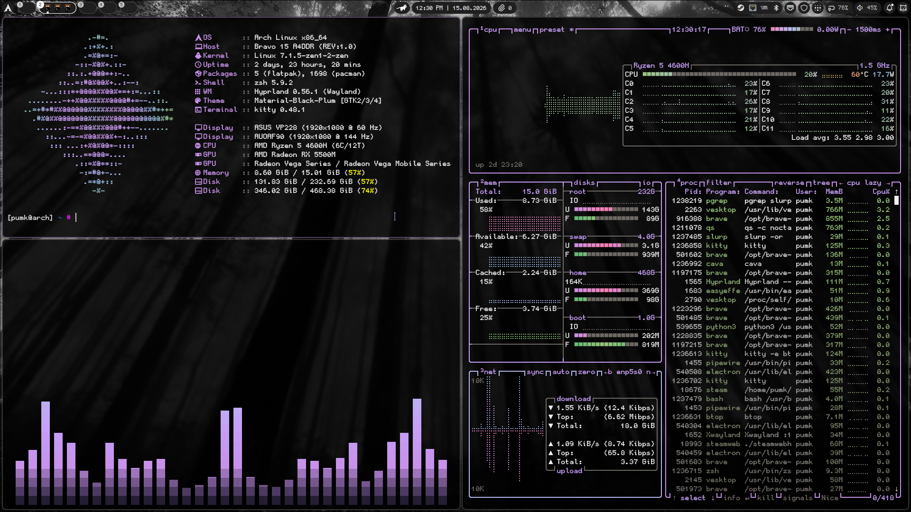
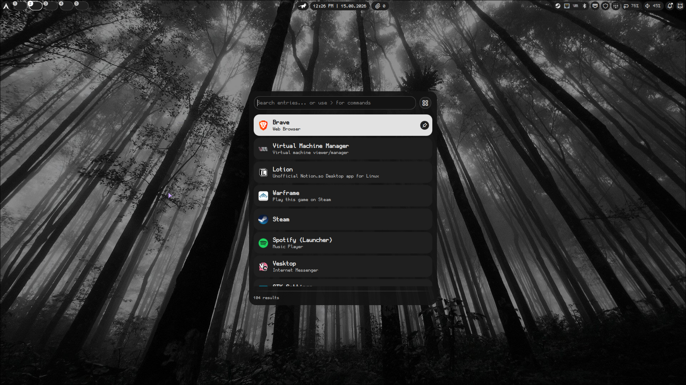
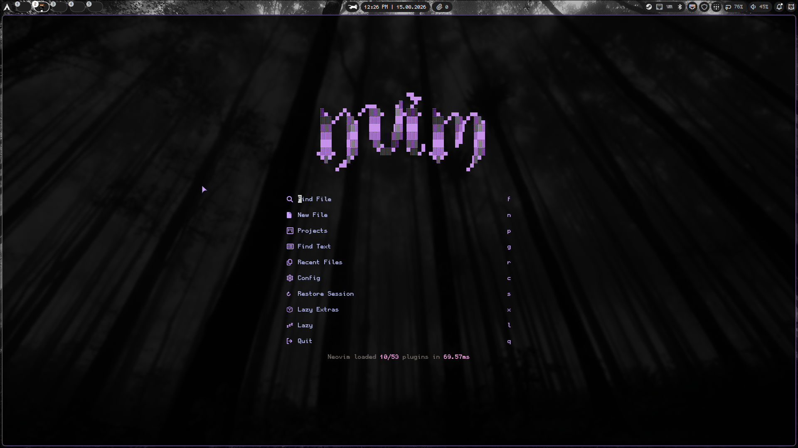
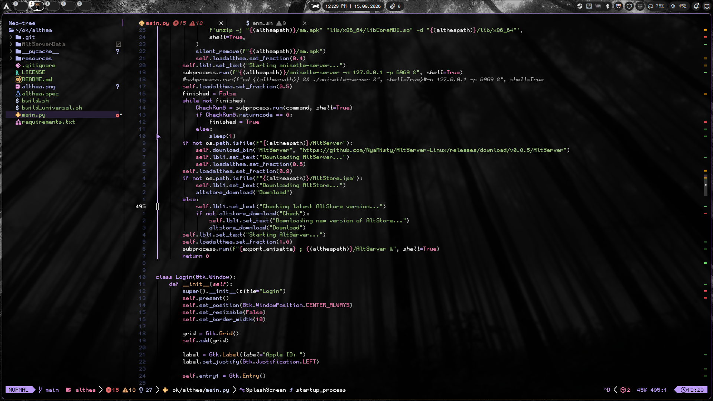
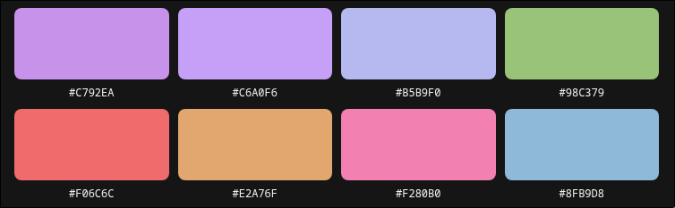

# dotfiles

 [Stack](#stack) | [Setup](#setup) | [Utilities](#utilities)

  My personal linux dotfiles.

## Screenshots


<p align="center"><i>Fastfetch System Info</i></p>


<p align="center"><i>App Launcher</i></p>


<p align="center"><i>Nvim</i></p>


<p align="center"><i>Nvim Code</i></p>



## Stack

| Component  | Choice                                             |
| ---------- | -------------------------------------------------- |
| **WM**     | [Hyprland](https://hyprland.org/)                  |
| **Bar**    | [Noctalia](https://github.com/Noctalia-Project)     |
| **Terminal** | [Kitty](https://sw.kovidgoyal.net/kitty/)          |
| **Shell**  | [Zsh](https://www.zsh.org/) + [Oh My Zsh](https://ohmyz.sh/) |
| **Editor** | [Neovim](https://neovim.io/) ([LazyVim](https://www.lazyvim.org/)) |
| **File Manager** | [Thunar](https://docs.xfce.org/xfce/thunar/start) |
| **Multiplexer** | [tmux](https://github.com/tmux/tmux)  |
| **Font** | [GohuFont](https://github.com/GohuFont/GohuFont) |

## Setup

Clone the repo and run the interactive setup script. Each app is backed up before replacement, and you can pick what to configure or install everything at once.

```sh
git clone https://github.com/Pumkin341/dotfiles.git
cd dotfiles
chmod +x setup.sh
./setup.sh
```

The setup menu supports installing everything (`0`) or configuring each app individually:

1. **Neovim** (LazyVim)
2. **Hyprland**
3. **Noctalia**
4. **Fastfetch**
5. **Kitty**
6. **Tmux**

## Utilities

**Apps**

- [EasyEffects](https://github.com/wwmm/easyeffects)
- [timeshift](https://github.com/linuxmint/timeshift)
- [spicetify](https://spicetify.app/)
- [qemu/kvm](https://www.qemu.org/)

**Terminal**

- [tmux](https://github.com/tmux/tmux)
- [Oh My Zsh](https://ohmyz.sh/)
- [btop](https://github.com/aristocratos/btop)
- [fastfetch](https://github.com/fastfetch-cli/fastfetch)
- [lazygit](https://github.com/jesseduffield/lazygit)
- [lazydocker](https://github.com/jesseduffield/lazydocker)

---
