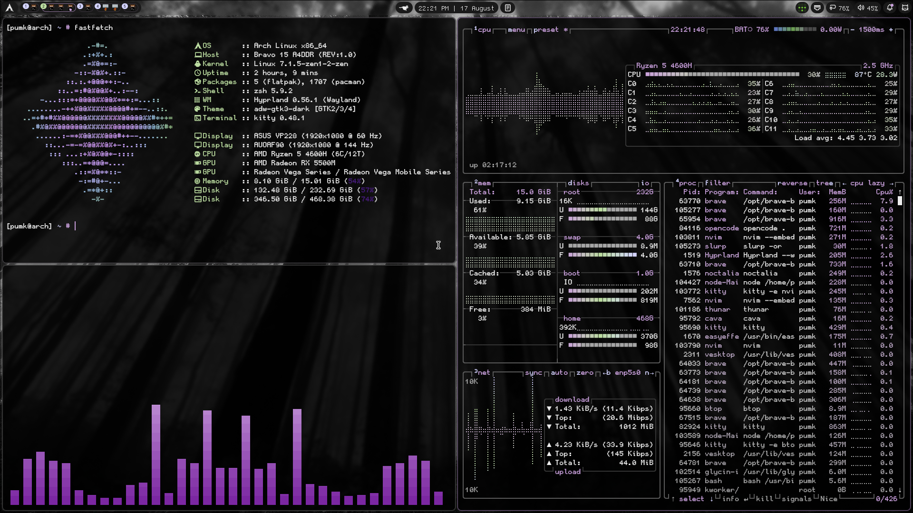
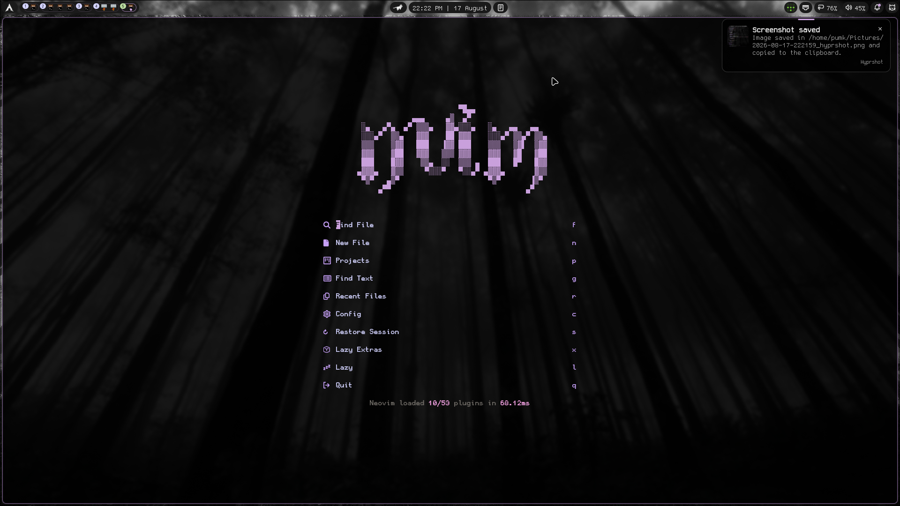
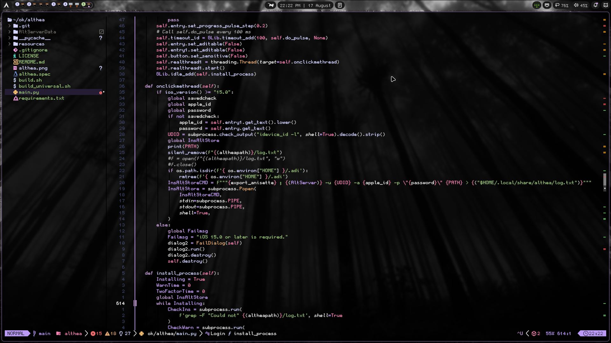
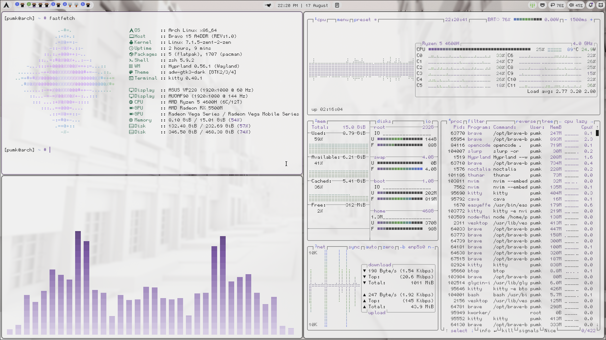
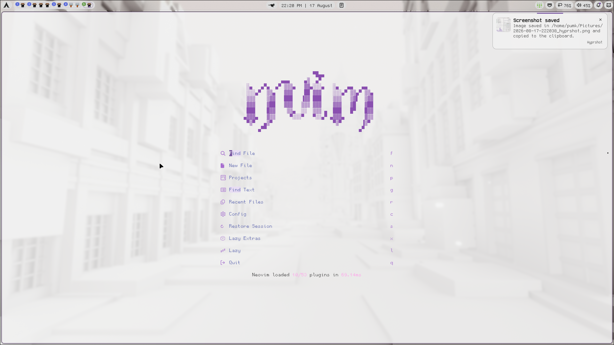
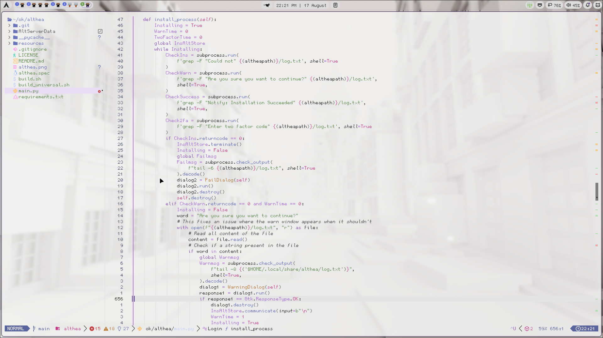

# dotfiles

 [Stack](#stack) | [Setup](#setup) | [Utilities](#utilities)

  My personal linux dotfiles.

## Screenshots

<div align="center">
<div style="display:flex; justify-content:center; gap:10px;">
  
  
  
</div>
<p><i>Dark Themes</i></p>

<br/>

<div style="display:flex; justify-content:center; gap:10px;">
  
  
  
</div>
<p><i>Light Themes</i></p>

</div>

## Stack

| Component  | Choice                                             |
| ---------- | -------------------------------------------------- |
| **WM**     | [Hyprland](https://hyprland.org/)                  |
| **Bar**    | [Noctalia](https://github.com/Noctalia-Project)     |
| **Terminal** | [Kitty](https://sw.kovidgoyal.net/kitty/)          |
| **Shell**  | [Zsh](https://www.zsh.org/) + [Oh My Zsh](https://ohmyz.sh/) |
| **Editor** | [Neovim](https://neovim.io/) ([LazyVim](https://www.lazyvim.org/)) |
| **File Manager** | [Thunar](https://docs.xfce.org/xfce/thunar/start) |
| **Multiplexer** | [tmux](https://github.com/tmux/tmux)  |
| **Font** | [GohuFont](https://github.com/GohuFont/GohuFont) |

## Setup

Clone the repo and run the interactive setup script. Each app is backed up before replacement, and you can pick what to configure or install everything at once.

```sh
git clone https://github.com/Pumkin341/dotfiles.git
cd dotfiles
chmod +x setup.sh
./setup.sh
```

The setup menu supports installing everything (`0`) or configuring each app individually:

1. **Neovim** (LazyVim)
2. **Hyprland**
3. **Noctalia** (v5)
4. **Noctalia** (v4)
5. **Fastfetch**
6. **Kitty**
7. **Tmux**
8. **Btop**
9. **Cava**
10. **Opencode**

### SDDM

Install the display manager and a login screen theme.

**1. Install SDDM**

```sh
sudo apt install sddm        # Ubuntu/Debian
sudo dnf install sddm        # Fedora
sudo pacman -S sddm          # Arch
```

**2. Copy the theme to the system themes folder**

SDDM looks for themes in `/usr/share/sddm/themes`. Put the `silent` theme folder from this repo there:

```sh
sudo cp -r sddm/themes/silent /usr/share/sddm/themes/
```

**3. Activate the theme**

Point SDDM to it in `/etc/sddm.conf`:

```ini
[Theme]
Current=silent
```

Create `/etc/sddm.conf` first if it does not exist. The theme name must match the folder name in `/usr/share/sddm/themes`.

**4. Enable SDDM**

```sh
sudo systemctl enable --now sddm
```

**5. Test the theme**

```sh
sddm --test-mode --theme /usr/share/sddm/themes/silent
```

Optionally hide the user list in `/usr/share/sddm/themes/silent/theme.conf`:

```ini
[General]
InputMethod=
```

More details: [Arch Wiki SDDM](https://wiki.archlinux.org/title/SDDM) and [`sddm.conf(5)`](https://man.archlinux.org/man/sddm.conf.5.en).

## Utilities

**Apps**

- [EasyEffects](https://github.com/wwmm/easyeffects)
- [timeshift](https://github.com/linuxmint/timeshift)
- [spicetify](https://spicetify.app/)
- [qemu/kvm](https://www.qemu.org/)

**Terminal**

- [tmux](https://github.com/tmux/tmux)
- [opencode](https://github.com/fabiokr/opencode)
- [Oh My Zsh](https://ohmyz.sh/)
- [btop](https://github.com/aristocratos/btop)
- [fastfetch](https://github.com/fastfetch-cli/fastfetch)
- [lazygit](https://github.com/jesseduffield/lazygit)
- [lazydocker](https://github.com/jesseduffield/lazydocker)

---
